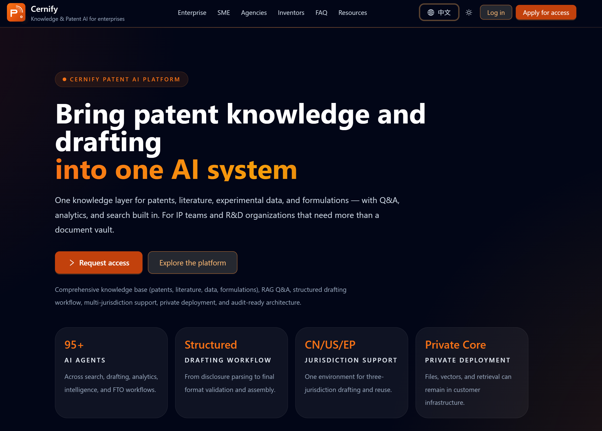
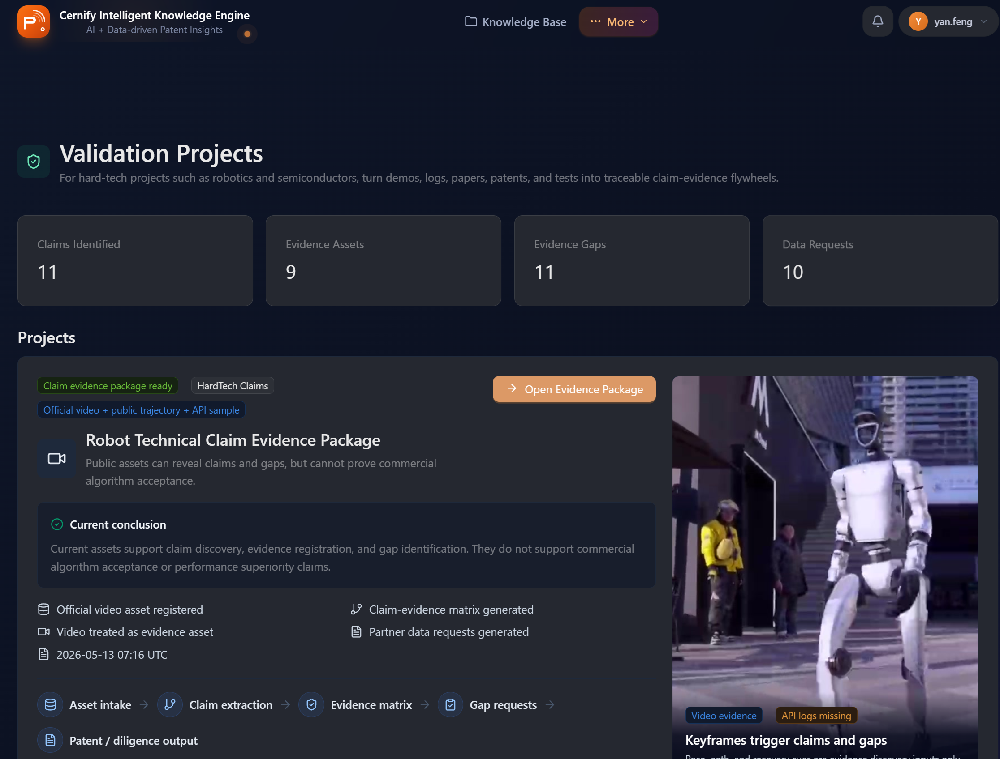
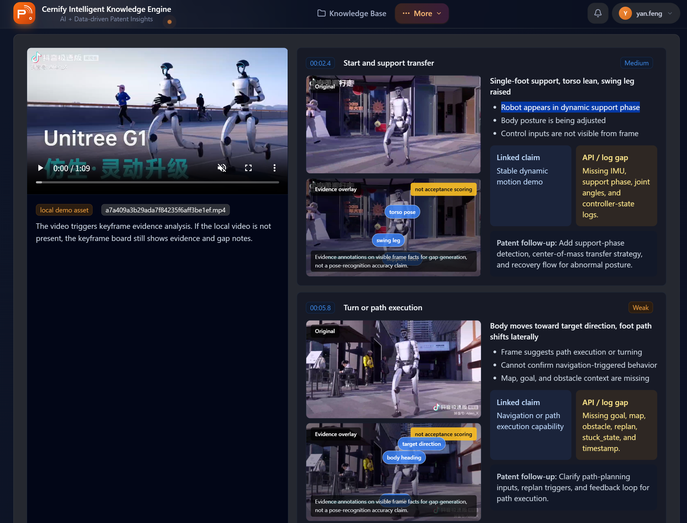

# Cernify Robot Patent Risk Copilot

Cernify turns robot product evidence into an interactive overseas patent risk map.

Cernify is a full-cycle AI patent platform with patent drafting as the core business. Search, evidence review, FTO preparation, office-action support, and portfolio analysis are connected workflows around drafting. This UCWS repository demonstrates one agent-callable application layer: turning robot product evidence into a structured patent-risk and drafting-preparation evidence package.

<p align="center">
  
</p>

<p align="center"><strong>Product evidence -> component graph -> evidence gaps -> patent-risk review workflow</strong></p>


## 60-Second Review Path

1. Look at the screenshot above to see the workflow surface.
2. Watch the public demo video: https://www.youtube.com/watch?v=jgG2NX9yF2I
3. Read [REVIEW_PACKET.md](REVIEW_PACKET.md) for the compressed UCWS review path.
4. Read [PROJECT_BRIEF.md](PROJECT_BRIEF.md) and [submission_manifest.json](submission_manifest.json) for structured project metadata.

Shareable sentence:

```text
Cernify turns robot product evidence into a drafting-ready patent review map.
```

## Demo

- Demo video: https://www.youtube.com/watch?v=jgG2NX9yF2I
- Submission: UCWS 2026
- Track: Application

Demo review map:

- `00:00` Problem: robotics FTO starts from product evidence, not keywords alone.
- `00:20` Product evidence input: public or synthetic robot evidence.
- `00:45` Component graph: robot modules and patent-sensitive subsystems.
- `01:10` Evidence gaps: observable vs inferred vs missing evidence.
- `01:30` Patent-risk map and human-review evidence report.

Strong positioning:

```text
Cernify is not a standalone patent-search tool. It is a full-cycle AI patent platform centered on patent drafting; this UCWS demo shows the product-evidence layer that prepares robotics FTO review and drafting inputs.
```

Recommended judge entry points:

- `REVIEW_PACKET.md` for the fastest 60-second path across community voting, scoring, and expert review.
- `EVALUATION_MAP.md` for explicit UCWS scoring alignment: community vote, AI evaluation, and expert judges.
- `PROJECT_BRIEF.md` for concise positioning, workflow, and repository evidence.
- `JUDGE_GUIDE.md` for a one-page review guide.
- `submission_manifest.json` for structured metadata.
- `pitch_90s.md` for the concise verbal pitch.
- `agent.md` for the capability contract and guardrails.


## UCWS Scoring Fit

| Scoring category | Weight | Why Cernify fits |
| --- | ---: | --- |
| Community vote | 30% | The story is easy to understand: robot product evidence becomes a visual patent-risk map and drafting-ready evidence package. The README, screenshots, public demo video, and 90-second pitch are built for quick browsing and sharing. |
| AI evaluation | 30% | The repository is structured for evaluation: clear README, public demo link, `PROJECT_BRIEF.md`, `submission_manifest.json`, capability manifests, examples, reports, screenshots, and explicit safety boundaries. |
| Expert judges | 40% | Cernify addresses a real global patent workflow: patent drafting and overseas review for robotics products. The technical depth comes from product evidence decomposition, component graphs, evidence graphs, patent-risk mapping, and schema-bound agent capabilities. |

See [EVALUATION_MAP.md](EVALUATION_MAP.md) for the full scoring-rule map.

## Project Brief

Cernify is a full-cycle AI patent platform with patent drafting as its core business. Cernify Robot Patent Risk Copilot is a UCWS application-layer demo of that platform: a product-evidence-first workflow for robotics companies expanding overseas. Unlike keyword-only patent search, it starts from robot product evidence such as images, product pages, specification sheets, demo video references, manuals, and patent drawings. It decomposes the robot into components, separates observable evidence from inference and missing evidence, maps technical features to patent-risk review areas, and generates a human-review evidence package that can feed drafting, review, and counsel workflows.

Core workflow:

```text
product evidence -> component graph -> evidence graph -> patent-risk map -> report artifact
```

Main UCWS contribution:

```text
Safe, schema-bound hardtech capabilities that connect product evidence to patent drafting and review workflows.
```

Capability IDs:

- `robot.product.decompose`
- `robot.patent.map_risk`
- `robot.fto.generate_evidence_report`

Evaluation hooks:

- Product evidence is converted into structured robot components.
- Evidence status is explicit: observable, inferred, missing, or out of scope.
- Patent-risk review is grounded in components and technical features.
- Evidence packages can feed patent drafting, review, and counsel workflows.
- Outputs are designed for human legal and technical review, not automatic legal conclusions.
- UCWS integration is capability-based and avoids exposing raw internal APIs.
- The public demo uses public or synthetic data only.

Project keywords:

```text
Cernify, full-cycle AI patent platform, patent drafting, AI patent drafting, invention disclosure,
robot patent risk, robotics FTO, freedom to operate workflow, patent intelligence, product evidence,
component graph, evidence graph, patent-risk map, hardtech validation, schema-bound capability, UCWS,
AI patent workflow, human review, public demo, synthetic data, community vote, AI evaluation,
expert judges, global robotics, commercialization potential, robot.product.decompose,
robot.patent.map_risk, robot.fto.generate_evidence_report
```


## Screenshots

| Main workflow | Validation overview | Validation detail |
| --- | --- | --- |
|  |  |  |

Screenshots use the public UCWS demo context and should not include customer data, credentials, browser network panels, tokens, internal task IDs, or private workspace URLs.

## What This Repository Includes

This repository contains the public UCWS demo layer for Cernify Robot Patent Risk Copilot:

- Capability schemas
- Synthetic and public-reference examples
- Sample component graphs
- Sample evidence graphs
- Sample patent-risk maps
- Sample FTO evidence reports
- Public documentation for the workflow

## What This Repository Does Not Include

This repository does not include Cernify's production platform, patent drafting engine, patent retrieval system, FTO reasoning engine, private datasets, customer workspaces, internal APIs, authentication system, billing system, deployment infrastructure, or production model prompts.

## Capability Flow

```text
product evidence -> component graph -> evidence graph -> patent-risk map -> report artifact
```

## Public Repository Scope

This repository open-sources the Cernify UCWS demo layer only. The production Cernify platform, patent drafting engine, and proprietary patent-risk engine remain closed-source.

See:

- [PUBLIC_BOUNDARY.md](PUBLIC_BOUNDARY.md)
- [LEGAL_DISCLAIMER.md](LEGAL_DISCLAIMER.md)
- [docs/media_rights.md](docs/media_rights.md)

## Third-Party Media

Full third-party source videos are not included in this repository. Keyframe images are also omitted in the first release.

Third-party robot images, product videos, video frames, screenshots, logos, product names, and trademarks remain owned by their respective rights holders. Unless explicitly stated otherwise, they are not covered by this repository's open-source license.

## Repository Contents

```text
README.md       Project entry point and repository summary
REVIEW_PACKET.md
                Fast 60-second packet for community voters, evaluation systems, and expert judges
PROJECT_BRIEF.md    Concise project positioning and repository evidence map
EVALUATION_MAP.md
                UCWS scoring alignment for community vote, AI evaluation, and expert judges
JUDGE_GUIDE.md  One-page guide for human judges
pitch_90s.md    Concise verbal pitch for demos and voting
submission_manifest.json
                Structured UCWS submission metadata
application.md  UCWS application narrative and submission checklist
agent.md        Capability contract, data policy, and guardrails
Cernify_Robot_Patent_Risk_Copilot_User_Manual_EN.md
                English user manual for judges and reviewers
capabilities/   UCWS-ready capability manifests and sample inputs/outputs
docs/           Architecture, data policy, media rights, and demo story
examples/       Public-reference or synthetic demo outputs
evidence-packs/ Evidence package outputs and source reference templates
reports/        Sample FTO evidence reports
screenshots/    Public demo screenshots and screenshot review notes
```

## Legal Disclaimer

The sample outputs, patent-risk maps, evidence reports, and FTO-related examples are for demonstration and research workflow purposes only.

They are not legal advice, not an infringement determination, not a validity opinion, not a freedom-to-operate legal opinion, and not a substitute for review by qualified patent counsel in the relevant jurisdiction.

## License

See [LICENSE](LICENSE) and [NOTICE](NOTICE). The license applies only to original files in this repository. It does not grant rights to Cernify trademarks, hosted services, proprietary datasets, production systems, or third-party media.

